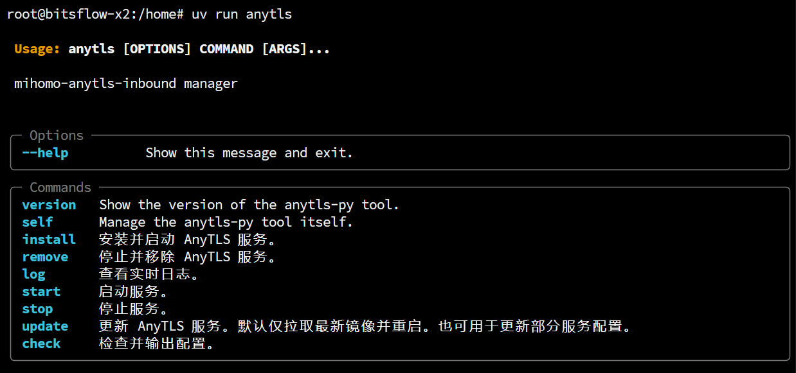

# anytls-py cli
借助 `mihomo` 构建 AnyTLS 容器服务，具备如下特性：

1. 支持配置域名，自动申请证书
2. 通过 Compose 管理容器服务，实现安全的自启和持久化运行
3. 遵循最佳实践的轻量化部署

## 速通指南

一键部署脚本，以 `uv tool` 的方式调度管理工具：

```bash
curl -LsSf https://astral.sh/uv/install.sh | sh && \
source $HOME/.local/bin/env; \
uv tool install anytls-py -U && \
uv run anytls self update && \
uv run anytls install -d <填写域名>
```

### uv

> [uv installation](https://docs.astral.sh/uv/getting-started/installation/) 

（可选）确保环境中存在 uv：

```bash
curl -LsSf https://astral.sh/uv/install.sh | sh
```

（可选）To add `$HOME/.local/bin` to your PATH, either restart your shell or run:

```bash
source $HOME/.local/bin/env (sh, bash, zsh)
source $HOME/.local/bin/env.fish (fish)
```

### Installation

使用 uv 以 tool 的方式安装 `anytls-py`:

```bash
uv tool install anytls-py
```
### Startup

一键安装指令：

```bash
uv run anytls install -d [DOMAIN]
```
| 必选参数         | 简介       |
| ---------------- | ---------- |
| `--domain`, `-d` | 绑定的域名 |

| 可选参数           | 简介                                                 |
| ------------------ | ---------------------------------------------------- |
| `--password`, `-p` | 手动指定连接密码 (可选，默认随机生成)                |
| `--ip`             | 手动指定服务器公网 IPv4 (可选，默认自动检测)         |
| `--port`           | 指定监听端口 (可选，默认 8443)                       |
| `--image`          | 指定托管镜像（可选，默认 `metacubex/mihomo:latest`） |

## 下一步

移除所有项目依赖：

```bash
uv run anytls remove
```

升级脚本：

```bash
uv run anytls self update
```

根据正在运行的服务配置生成 `mihomo client outbound` 配置：

```bash
uv run anytls check
```

探索其他指令：

```bash
uv run anytls --help
```

